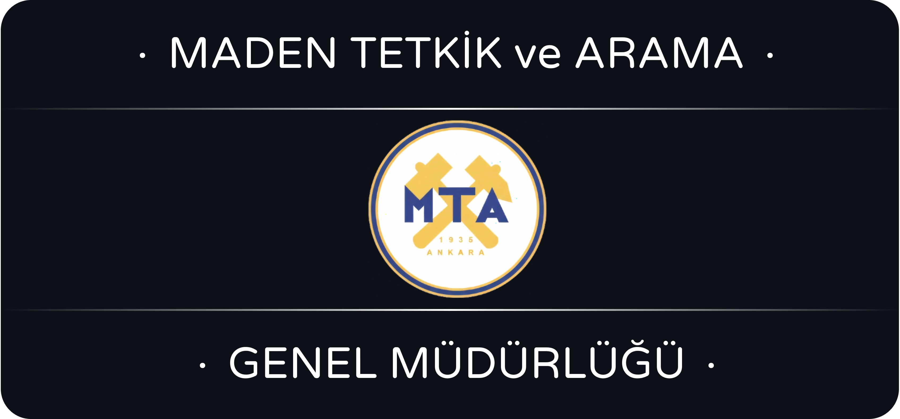

# MTA-Staj Raporu

Bu repo, 30 iş günü boyunca Maden Analizleri ve Teknolojileri Dairesi'ne bağlı Jeokimya ve Analitik Kimya birimlerinde yapılan staj kapsamında hazırlandı.

Bu bağlamda hazırlanan staj raporu toplamda 6 bölümden oluşmakta:
1. LECO (C/S Elementel Analizörü) Staj Raporu
2. AAS Staj Raporu
3. ICP-OES Yöntemi Staj Raporu
4. ICP-MS Yöntemi Staj Raporu
5. Co (Kobalt) Kalibrasyon Analizi Staj Raporu
6. Spektral Veri Analizi Staj Raporu

İlk dört bölümde cihazlar ve spektroskopik yöntemler ayrıntılı olarak anlatılmış, her bölümün sonunda örnek numune analizi yapılmıştır. Son iki bölümde ise Agilent 5800 ICP‑OES ile elde edilen veriler anonimleştirilerek TensorFlow ve Savitzky–Golay filtresi ile analiz edilmiş ve sonuçlar sunulmuştur.

Bu raporu yazarken ve özellikle de kodlama kısmında çok büyük emeği geçen Gökhan Özgenç Bey'e saygılar ve sevgiler.

## 🔥 Leco CS744 (C/S Elemental Analizörü) Staj Raporu 
- 1 Giriş  
- 1.1 Cihaz Bölümleri  
 - 1.1.1 Platin Silika Katalizörü  
 - 1.1.2 Akış Temizleyici: Anhydrone (Magnezyum Perklorat)  
 - 1.1.3 Partikül Filtresi  
 - 1.1.4 Selüloz Filtresi  
- 1.2 Analiz Kapsamı ve Hizmet Bilgileri  
- 1.3 Cihazın Çalışma Prensibi  
- 1.4 Standart ve CRM’ler  
- 1.5 Hazırlanacak Ekipman ve Malzemeler  
- 1.6 Enstrümanın Hazırlığı  
 - 1.6.1 Ambient/Ortam Parametrelerinin Kontrolü  
 - 1.6.2 System Check / Cihaz Tüm Ünite Kontrolü  
- 1.7 Analiz Örneği: Boş Örnek / Blank  
- 1.8 Analiz Örneği: Standart  
- 1.9 Analiz Örneği: Sample/Numune  
- 1.10 Analiz Sonuçlarının Değerlendirilmesi  
- 1.11 Makineyi Güvenli Kapatma  
- 1.12 Ek-1: LECO CS744-Series Tüketim Malzemeleri & Yedek Parça Referans Kartı  

## 🔦 AAS Staj Raporu
- 2.1 Giriş ve Teori  
  - 2.1.1 F-AAS, GF-AAS, HG-AAS  
  - 2.1.2 Atomizasyon Yaklaşımları  
  - 2.1.3 Avantajlar ve Sınırlılıklar  
- 2.2 Kullanılan F-AAS Cihazı  
- 2.3 Geleneksel Metot vs Hızlı Sıralı mod (Fast Sequential)  
  - 2.3.1 Conventional Mode / Geleneksel Metot  
- 2.4 Temel Bileşenler ve Prensipler  
  - 2.4.1 Işık Kaynağı: HCL  
  - 2.4.2 Optik Yol ve Monokromatör  
  - 2.4.3 Monokromatör ve İlgili Optikler  
  - 2.4.4 Czerny–Turner Monokromatörü  
- 2.5 Prosedürler ve Periyodik Bakım Yönergeleri  
  - 2.5.1 Genel Hazırlık Prosedürü  
  - 2.5.2 Kapatma Prosedürü  
  - 2.5.3 Bakım Prosedürleri  
- 2.6 Numune Hazırlama ve Raporlama  
  - 2.6.1 Analiz Sonucu  
  - 2.6.2 Analiz Sonucu  
  - 2.6.3 Sonuçların İncelenmesi  

## 📸 ICP-OES Yöntemi Staj Raporu

- 3.1 Giriş ve Teorik Temeller
  - 3.1.1 Elementel Analiz ve ICP-OES’in Yeri
  - 3.1.2 Atomik Emisyon Spektroskopisinin Temelleri
  - 3.1.3 ICP-OES’in Temel Prensipleri
- 3.2 Atomik Emisyon Spektroskopisi – Teorik Temeller
  - 3.2.1 Termal eksitasyon ve radyatif gevşeme mekanizmaları
    - 3.2.1.1 Termal eksitasyon / Termal Uyarım
    - 3.2.1.2 Radyatif gevşeme
    - 3.2.1.3 Enerji Seviyeleri ve Atomik Geçişler
    - 3.2.1.4 Uyarılma Süreci
    - 3.2.1.5 Gevşeme ve Foton Emisyonu
  - 3.2.2 Temel Spektral Terimler
    - 3.2.2.1 LOD (Tespit Limiti)
    - 3.2.2.2 LOQ (Tayin Limiti)
    - 3.2.2.3 RSD (Bağıl Standart Sapma)
    - 3.2.2.4 EIE Etkisi
  - 3.2.3 Temel fiziksel yasalar ve matematiksel ilişkiler
    - 3.2.3.1 Beer–Lambert
    - 3.2.3.2 Planck Yasası
    - 3.2.3.3 Boltzmann Dağılımı
- 3.3 ICP-OES Yöntemi Cihazının Tanıtımı ve Yapısı
  - 3.3.1 ICP-OES Cihazının Genel Tanıtımı
  - 3.3.2 Kullanılan cihazın marka/modeli ve teknik özeti
  - 3.3.3 Parçalar ve Tanımlamaları
    - 3.3.3.1 Nebulizer
    - 3.3.3.2 Spraychamber
    - 3.3.3.3 Torch
    - 3.3.3.4 Work Coil / RF Coil
    - 3.3.3.5 Snout
- 3.4 Cihaz Operasyonu ve Periyodik Bakımlar
  - 3.4.1 Açılış – kapanış prosedürleri
    - 3.4.1.1 Açılış Prosedürleri ve Numune Analizine Hazır Hale Getirme
    - 3.4.1.2 Kapanış Prosedürleri
  - 3.4.2 Kontrol prosedürleri
    - 3.4.2.1 Kullanıcı Bakım Sayaçları
  - 3.4.3 Rutin Bakım Zaman Çizelgesi
- 3.5 Numune Hazırlama ve Kalibrasyon
  - 3.5.1 Numune Kabul Süreci
    - 3.5.1.1 Analiz Yöntemleri ve Kodları
  - 3.5.2 Çözme Yöntemleri
  - 3.5.3 Numune Hazırlama Birimi İş Akışı
  - 3.5.4 Jeokimyasal Analizlerde Çözme Yöntemleri
  - 3.5.5 Kalibrasyon Çözeltileri: Seri Hazırlama, İç Standart, Matrix Matching
    - 3.5.5.1 Kalibrasyon Çözeltilerinin Hazırlanması
    - 3.5.5.2 Dahili Standart (Internal Standard)
    - 3.5.5.3 Matrix Matching
    - 3.5.5.4 CRM ile Validasyon
- 3.6 Pilot Numune Analizi – Deneysel Çalışma
  - 3.6.1 Analiz konfigürasyonları ve analizi
    - 3.6.1.1 Elementlerin seçimi
    - 3.6.1.2 Koşullar
    - 3.6.1.3 Standartlar
    - 3.6.1.4 Sıra
    - 3.6.1.5 Autosampler
    - 3.6.1.6 Analiz

## 👨‍🚀 ICP-MS Yöntemi Staj Raporu

- 4.1 ICP-MS Yöntemi Cihazlarının Yapıları
  - 4.1.1 Baştan Sona Analize Genel Bakış
  - 4.1.2 ICP-MS Yöntemi Cihazına Genel Bakış
  - 4.1.3 ICP-MS Yöntemi Cihazının Parçaları
    - 4.1.3.1 Plazma Kaynağı
    - 4.1.3.2 Cone: Sampler Cone & Skimmer Cone
    - 4.1.3.3 İyon Lensi & Çarpışma/Reaksiyon Hücresi
    - 4.1.3.4 Quadrupole Mass Filter (Kuadrupol)
    - 4.1.3.5 Elektron Çoğaltıcı Dedektör
  - 4.1.4 Cone: ICP-OES vs ICP-MS
  - 4.1.5 ICP-MS Yöntemi ve Avantajları
- 4.2 Numune Analizi Süreci
  - 4.2.1 Analiz Numunesini Hazırlama
  - 4.2.2 MassHunter Workstation Programının Kullanılması
    - 4.2.2.1 MassHunter Workstation’ın Başlatılması
    - 4.2.2.2 Donanım Ayarlarının Kontrol Edilmesi
    - 4.2.2.3 Analiz Öncesi Hazırlık
    - 4.2.2.4 Plazma Açma ve Başlangıç İşlemlerinin Gerçekleştirilmesi
    - 4.2.2.5 Cihaz Durumunun Kontrol Şeması
    - 4.2.2.6 Batch Oluşturma
    - 4.2.2.7 Kuyruğun Çalıştırılması
    - 4.2.2.8 Analiz Sonuçlarının Kontrolü
    - 4.2.2.9 Kalibrasyon Grafiklerinin İncelenmesi
    - 4.2.2.10 Sonuçlar ve İncelenmesi
    - 4.2.2.11 Numune Analizi Bölümünde Kullanılan Kaynaklar
- 4.3 Önceden Ayarlanmış Yöntem Türleri
  - 4.3.1 İçme Suyu (He ile)
  - 4.3.2 Yüksek Matris
  - 4.3.3 Düşük Matris

## 🧠 Co (Kobalt) Kalibrasyon Analizi Staj Raporu

- 5.1 Giriş ve Amaç  
- 5.2 Metodoloji   
- 5.3 Veri Seti ve Hazırlık  
- 5.4 Ham Spektrumların Görselleştirilmesi  
  - 5.4.1 Spektrum Analizi Amaçları  
  - 5.4.2 Spektrum Görselleştirme  
  - 5.4.3 Pik Bölgesi Analizi  
- 5.5 Background Subtraction (Arka Plan Çıkarma)  
- 5.6 Pik Yüksekliklerinin Hesaplanması  
- 5.7 TensorFlow ile Kalibrasyon Modeli  
  - 5.7.1 Model Hazırlığı  
  - 5.7.2 Normalizasyon  
  - 5.7.3 Convergence (Yakınsama)  
  - 5.7.4 Model Mimarileri  
  - 5.7.5 TensorFlow & Keras  
    - 5.7.5.1 Lineer Model  
    - 5.7.5.2 Polinom Model  
- 5.8 Model Eğitimi Çıktıları  
  - 5.8.1 Lineer Model Eğitimi  
  - 5.8.2 Polinom Model Eğitimi  
  - 5.8.3 Model Tahminleri ve Karşılaştırma  
- 5.9 Sonuçlar ve Değerlendirme  
- 5.10 R² (Determinasyon Katsayısı) Değerlendirmesi  
- 5.11 RMSE (Kök Ortalama Kare Hata) Değerlendirmesi  
- 5.12 Sonuç ve Öneriler  

## 📈 Spektral Veri Analizi Staj Raporu

- 6.1 Ana Spektral Veri İşleme Pipeline Fonksiyonu  
- 6.2 Spektral Veri Görselleştirme ve Peak Analizi Fonksiyonları  
- 6.3 Arka Plan Düzeltme, İnterpolasyon ve Düzgünleştirme  
- 6.4 İlk İşleme Testi ve Sonuçlarının Değerlendirilmesi  
  - 6.4.1 Windows ve Poly Değerlerinin Karşılaştırmalı Gösterimi  
  - 6.4.2 Window Length (WL) Parametresinin Etkisi  
  - 6.4.3 PO = 1 vs PO = 5  
  - 6.4.4 Polynomial Order (PO) Parametresinin Etkisi  
  - 6.4.5 Çözüm  
  - 6.4.6 En İyi Değerler ile Co’nun Yeni Pik Bölgesinin Grafiği  
  - 6.1.7 Hybrid-2Seg  
  - 6.1.8 Hybrid-3Seg  
- 6.5 Hibrit Yöntemlerin Performans Karşılaştırması    

## 📚 Rapor İçi Hatalı Bölüm

Raporlar her ne kadar ben ve IK biriminin kontrolünden geçmiş olsa da, eğer ki hatalı bir yer (yanlış bilgi vs.) varsa `Issues` kısmından belirtmeniz halinde ışık hızıyla düzeltmeye çalışacağım, şimdiden teşekkürler.

## 📑 Lisans

- Raporlar: CC BY 4.0 (bkz. `LICENSE-CC-BY-4.0`). Bu repo'yu kaynak göstererek kullanabilirsiniz.
- Kod örnekleri ve betikler: MIT Lisansı (bkz. `LICENSE-MIT`).

Not: Üçüncü taraf görseller/alıntılar kendi lisanslarına tabidir ve bu lisansların kapsamı dışındadır.